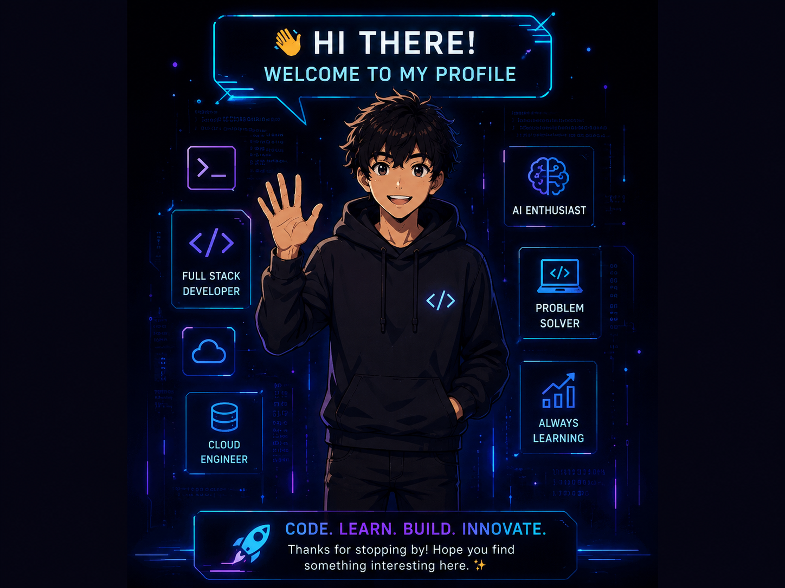

<div align="center">


</div>

<div align="center">

[](https://git.io/typing-svg)

</div>

<br>

<div align="center">

[](mailto:shaik.karim3214@gmail.com)&nbsp;&nbsp;
[](http://www.linkedin.com/in/karimulla-shaik-97a872258)&nbsp;&nbsp;
[](https://github.com/karim3214s)

</div>

<br>

---

## 👋 About Me

<div align="center">

*"Heroes are made by the path they choose, not the powers they are graced with."* - **Iron Man**

</div>

<br>

<table>
<tr>
<td valign="top" width="55%">

```yaml
Name        : Shaik Karimulla
Location    : India 🇮🇳
Role        : AI & ML Engineer
Degree      : B.Tech in AI & ML
Goal        : Full Stack + Cloud + AI

Interests:
  - Artificial Intelligence
  - Full Stack Development
  - Cloud Engineering (AWS)
  - Computer Vision
  - Data Analytics

Learning:
  - Advanced Backend Systems
  - AWS Architecture
  - Scalable Microservices

Hobbies     : [Coding 💻, Gaming 🎮, Movies 🎬, Music 🎵]
Motto       : "Code. Learn. Build. Innovate."
```

</td>
<td valign="middle" align="center" width="45%">



</td>
</tr>
</table>

<br>

---

## ⚡ Tech Arsenal

<br>

<div align="center">

### 🖥️ Languages & Frameworks

<br>

<table border="0" cellspacing="16" cellpadding="10">
<tr>
<td align="center"><br/><sub><b>Python</b></sub></td>
<td align="center"><br/><sub><b>JavaScript</b></sub></td>
<td align="center"><br/><sub><b>HTML5</b></sub></td>
<td align="center"><br/><sub><b>CSS3</b></sub></td>
<td align="center"><br/><sub><b>Flask</b></sub></td>
<td align="center"><br/><sub><b>Bootstrap</b></sub></td>
</tr>
</table>

<br>

### 🤖 AI / ML

<br>

<table border="0" cellspacing="16" cellpadding="10">
<tr>
<td align="center"><br/><sub><b>TensorFlow</b></sub></td>
<td align="center"><br/><sub><b>OpenCV</b></sub></td>
<td align="center"><br/><sub><b>Pandas</b></sub></td>
<td align="center"><br/><sub><b>NumPy</b></sub></td>
<td align="center"><br/><sub><b>Matplotlib</b></sub></td>
</tr>
</table>

<br>

### 🗄️ Databases & Cloud

<br>

<table border="0" cellspacing="16" cellpadding="10">
<tr>
<td align="center"><br/><sub><b>MySQL</b></sub></td>
<td align="center"><br/><sub><b>PostgreSQL</b></sub></td>
<td align="center"><br/><sub><b>AWS</b></sub></td>
</tr>
</table>

<br>

### 🛠️ Dev Tools

<br>

<table border="0" cellspacing="16" cellpadding="10">
<tr>
<td align="center"><br/><sub><b>Git</b></sub></td>
<td align="center"><br/><sub><b>GitHub</b></sub></td>
<td align="center"><br/><sub><b>VS Code</b></sub></td>
</tr>
</table>

</div>

<br>

---

## 🚀 Projects

<br>

### 🏥 Hospital Management System


Full-stack healthcare platform featuring **role-based access control**, **REST APIs**, and **workflow automation** built on PostgreSQL.

- 🔐 Multi-role auth system — Admin, Doctor, Patient dashboards
- 🔁 Automated appointment & billing workflows
- 📡 RESTful API architecture with Flask

[](https://github.com/Karim3214s/Hospital-Management-System)

<br>

---

### 🏫 School Management System


Web-based academic and administration management system with **structured backend operations** and **role management**.

- 👨‍🎓 Student, faculty, and admin role separation
- 📋 Attendance, grades, and timetable management
- 🗃️ Relational data modelling with MySQL

[](https://github.com/Karim3214s/school-management-system)

<br>

---

### 🖼️ Pixels — AI Image Restoration


AI-powered image restoration using **CNN models** for **denoising**, **super-resolution**, and **visual enhancement**.

- 🧠 Custom CNN architecture trained for image denoising
- 🔬 Super-resolution pipeline with OpenCV preprocessing
- 🖼️ Supports batch processing for large image sets

[](https://github.com/Karim3214s)

<br>

---

### 📊 Health Care Data Analysis


End-to-end data analysis pipeline using Python, Pandas, NumPy, and Matplotlib to surface **actionable healthcare insights**.

- 📊 Exploratory data analysis on real healthcare datasets
- 📉 Trend visualisation with Matplotlib & Seaborn
- 🧹 Full data cleaning and preprocessing pipeline

[](https://github.com/Karim3214s/Health-Care-Analysis)

<br>

---

## 🏆 Achievements

<div align="center">

| 🥇 APP-Quest Challenge | ☁️ AWS & Cloud Computing | 📊 Data Science & Power BI |
|:---:|:---:|:---:|
|  |  |  |

<br>

| 🤖 AI & ML Engineering | 🚀 Scalable Systems Builder |
|:---:|:---:|
|  |  |

</div>

<br>

---

<div align="center">

### ⚡ Code &nbsp;•&nbsp; Learn &nbsp;•&nbsp; Build &nbsp;•&nbsp; Innovate

*“Sometimes you gotta run before you can walk.”* — **Tony Stark**

<br>

⚡ Thanks for visiting — let's connect, collaborate, and create something meaningful together.

<br>


</div>
